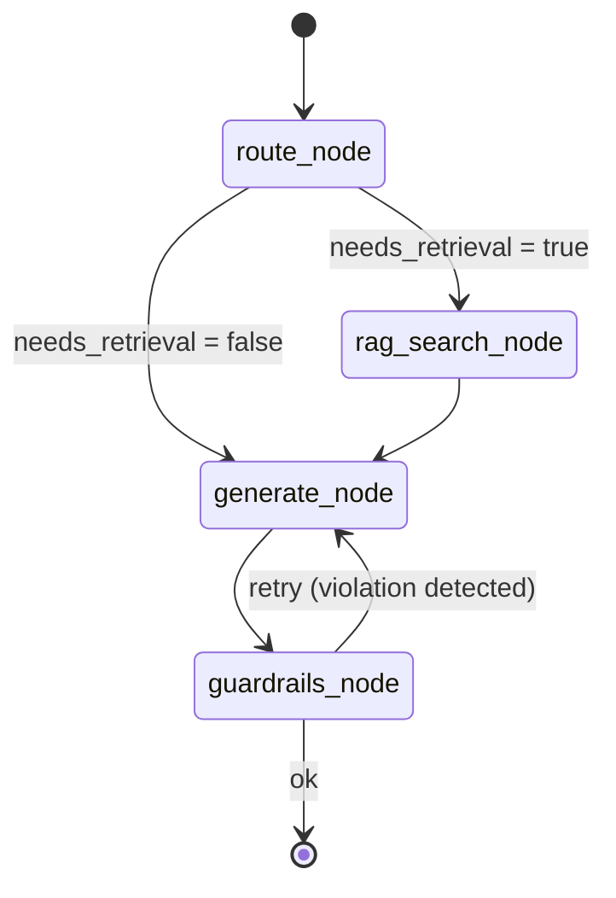

# Architecture

## Overview

The system is structured in four layers following Clean Architecture principles.
Each layer depends only on layers below it; the domain layer (`core/`) has zero external dependencies.

## Layer Diagram

```
┌──────────────────────────────────────────────────────────────┐
│                      HTTP Clients                            │
└───────────────────────────┬──────────────────────────────────┘
                            │ HTTP (JSON / multipart)
┌───────────────────────────▼──────────────────────────────────┐
│                    API Layer (FastAPI)                        │
│  routes/chat.py  routes/documents.py  routes/health.py       │
│  middleware/auth.py  middleware/logging.py                    │
└───────────────────────────┬──────────────────────────────────┘
                            │ calls
┌───────────────────────────▼──────────────────────────────────┐
│              Agent Layer (LangGraph)                         │
│  graph.py (StateGraph)  tools.py  memory.py                  │
└──────────┬───────────────────────────────┬───────────────────┘
           │ retrieval                     │ generation
┌──────────▼──────────┐        ┌──────────▼──────────────────┐
│   RAG Pipeline      │        │   Infra: litellm/OpenRouter  │
│  ingestion/         │        │   llm_client.py              │
│  embedder.py        │        └─────────────────────────────-┘
│  retriever.py       │
└──────────┬──────────┘
           │ reads/writes
┌──────────▼──────────┐
│   Infra: ChromaDB   │
│   vector_store.py   │
└─────────────────────┘

Cross-cutting (all layers):
  guardrails/filters.py      ← input/output safety on every chat request
  observability/telemetry.py ← OTel spans + Prometheus metrics on every call
```

## Agent State Machine



## Data Flow — Chat Request

```
POST /chat
  │
  ├─ middleware/auth.py         → validate X-API-Key
  ├─ middleware/logging.py      → structured request log
  ├─ guardrails/filters.py      → check input (PII, injection, length)
  │
  └─ agent/graph.py (invoke)
       ├─ route_node             → classify query (RAG needed?)
       ├─ rag_search_node        → embedder.embed(query) → retriever.search()
       │    └─ infra/vector_store.py (ChromaDB query)
       ├─ generate_node          → litellm.acompletion(messages + context)
       │    └─ infra/llm_client.py (OpenRouter)
       └─ guardrails_node        → check output (PII in response)
  │
  └─ ChatResponse (answer, sources, latency_ms)
```

## Data Flow — Document Ingest

```
POST /documents/ingest
  │
  ├─ middleware/auth.py
  └─ rag/ingestion/pipeline.py
       ├─ loader.py              → load(file/url) → list[Document]
       ├─ splitter.py            → split(docs) → list[Chunk]
       ├─ embedder.py            → embed(chunks) → list[vector]
       └─ infra/vector_store.py  → store(chunks, vectors) → ChromaDB
```

## Security Layers

```
Request
  ↓
[X-API-Key check]          ← unauthorized → 401
  ↓
[Input guardrail]          ← PII / injection → 422
  ↓
[Agent execution]
  ↓
[Output guardrail]         ← PII in LLM response → redacted
  ↓
Response
```

## Observability

Every LLM call and retrieval is wrapped with:
- An OpenTelemetry span (traceable from the HTTP request to the LLM response)
- Prometheus counter increment
- Prometheus histogram observation (latency)

Grafana dashboard at `docker/grafana/dashboard.json` provides:
- Request rate and error rate
- P50/P95/P99 retrieval and LLM latency
- Active sessions gauge
