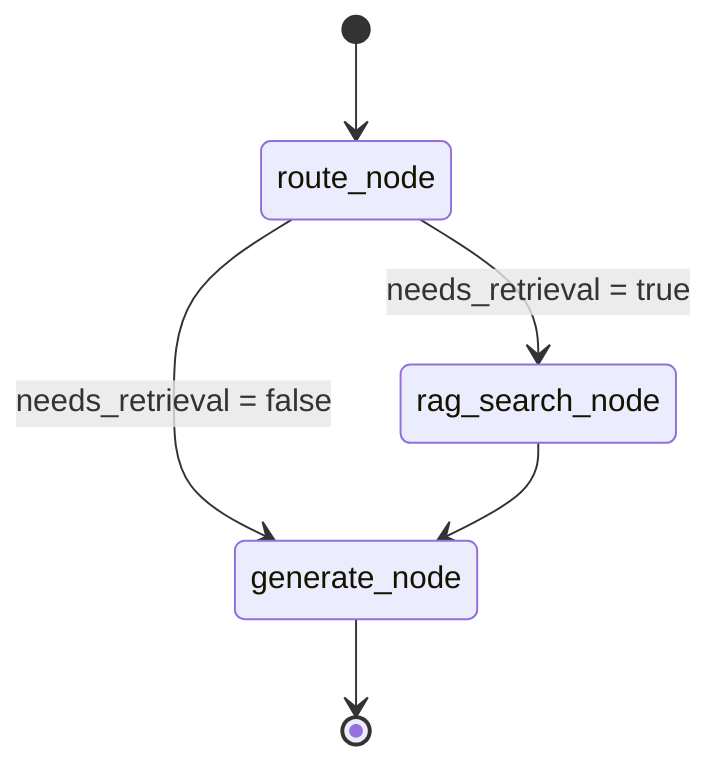

# Architecture

## Overview

The system follows a hexagonal (ports & adapters) architecture. Dependencies only
flow inward, toward `domain/` and `ports/`: the domain layer (`domain/`) has zero
external dependencies, `ports/` defines the ABC boundaries, `application/` implements
the inbound ports and depends only on the outbound ports, and `adapters/` implements
the outbound ports (secondary) or drives the inbound ports (primary).

## Layer Diagram

```
┌──────────────────────────────────────────────────────────────┐
│                      HTTP Clients                            │
└───────────────────────────┬──────────────────────────────────┘
                            │ HTTP (JSON / multipart)
┌───────────────────────────▼──────────────────────────────────┐
│      Primary Adapter — API Layer (adapters/primary/api/)     │
│  routes/chat.py  routes/documents.py  routes/health.py       │
│  middleware/auth.py  middleware/logging.py                    │
│  depends only on ports/inbound.py (IChatUseCase, IIngestUseCase)│
└───────────────────────────┬──────────────────────────────────┘
                            │ calls via inbound ports
┌───────────────────────────▼──────────────────────────────────┐
│         Application Layer — Agent (application/agent/)        │
│  graph.py (AgentGraph : IChatUseCase)  tools.py  memory.py   │
└──────────┬───────────────────────────────┬───────────────────┘
           │ retrieval                     │ generation
┌──────────▼──────────┐        ┌──────────▼──────────────────┐
│ Application — RAG    │        │ Secondary Adapter: litellm/  │
│ (application/rag/)   │        │ OpenRouter (adapters/         │
│  ingestion/          │        │ secondary/llm_client.py)     │
│  embedder.py         │        │ implements ILLMClient        │
│  retriever.py        │        └─────────────────────────────-┘
└──────────┬──────────┘
           │ reads/writes via IVectorStore
┌──────────▼──────────────────────┐
│ Secondary Adapter: ChromaDB      │
│ (adapters/secondary/vector_store.py) │
└──────────────────────────────────┘

Ports (the boundary every arrow above crosses):
  ports/inbound.py  — IChatUseCase, IIngestUseCase (primary adapter depends on these;
                       application implements them)
  ports/outbound.py — ILLMClient, IVectorStore, ISessionStore, IDocumentLoader
                       (application depends on these; adapters/secondary implements them)

Cross-cutting (all layers, outside the hexagon):
  guardrails/filters.py      ← input/output safety on every chat request
  observability/telemetry.py ← OTel spans + Prometheus metrics on every call
```

## Agent State Machine



Note: guardrails (`check_input` / `check_output`) are applied in the API route
(`adapters/primary/api/routes/chat.py`), not inside the agent graph.

## Data Flow — Chat Request

```
POST /chat
  │
  ├─ adapters/primary/api/middleware/auth.py     → validate X-API-Key
  ├─ adapters/primary/api/middleware/logging.py  → structured request log
  ├─ guardrails/filters.py                       → check input (PII, injection, length)
  │
  └─ application/agent/graph.py (AgentGraph.invoke, via IChatUseCase)
       ├─ route_node             → classify query (RAG needed?)
       ├─ rag_search_node        → embedder.embed(query) → retriever.search()
       │    └─ adapters/secondary/vector_store.py (ChromaDB query, via IVectorStore)
       └─ generate_node          → litellm.acompletion(messages + context)
            └─ adapters/secondary/llm_client.py (OpenRouter, via ILLMClient)
  │
  ├─ guardrails/filters.py       → check_output (PII redaction on LLM answer)
  └─ ChatResponse (answer, sources, latency_ms)
```

## Data Flow — Document Ingest

```
POST /documents/ingest
  │
  ├─ adapters/primary/api/middleware/auth.py
  └─ application/rag/ingestion/pipeline.py (IngestPipeline.run, via IIngestUseCase)
       ├─ adapters/secondary/loaders.py     → load(file/url) → list[Document] (via IDocumentLoader)
       ├─ ingestion/splitter.py             → split(docs) → list[Chunk]
       ├─ embedder.py                       → embed(chunks) → list[vector]
       └─ adapters/secondary/vector_store.py → store(chunks, vectors) → ChromaDB (via IVectorStore)
```

## Security Layers

```
Request
  ↓
[X-API-Key check]          ← unauthorized → 401
  ↓
[Input guardrail]          ← PII / injection → 422
  ↓
[Agent execution]
  ↓
[Output guardrail]         ← PII in LLM response → redacted
  ↓
Response
```

## Observability

Every LLM call and retrieval is wrapped with:
- An OpenTelemetry span (traceable from the HTTP request to the LLM response)
- Prometheus counter increment
- Prometheus histogram observation (latency)

Grafana dashboard at `docker/grafana/dashboard.json` provides:
- Request rate and error rate
- P50/P95/P99 retrieval and LLM latency
- Active sessions gauge
